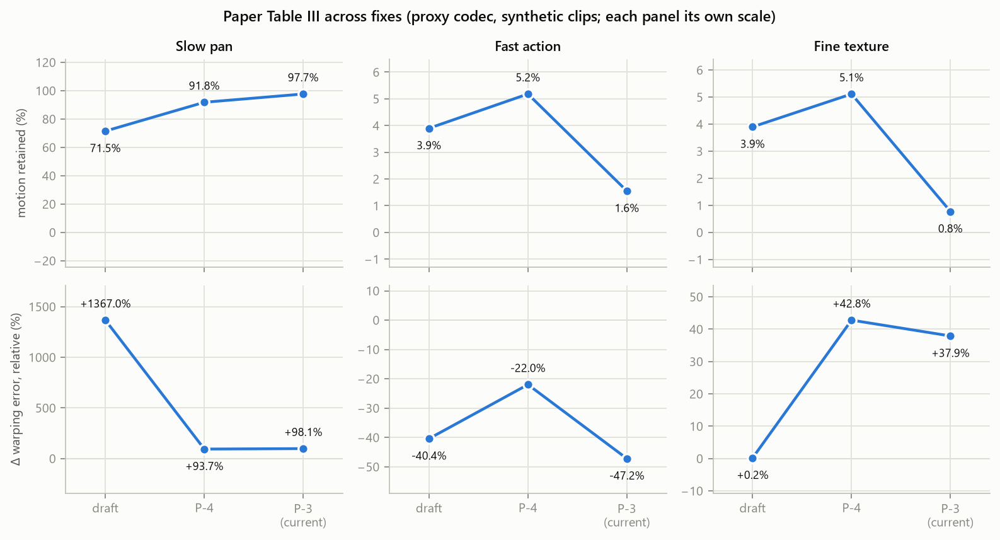
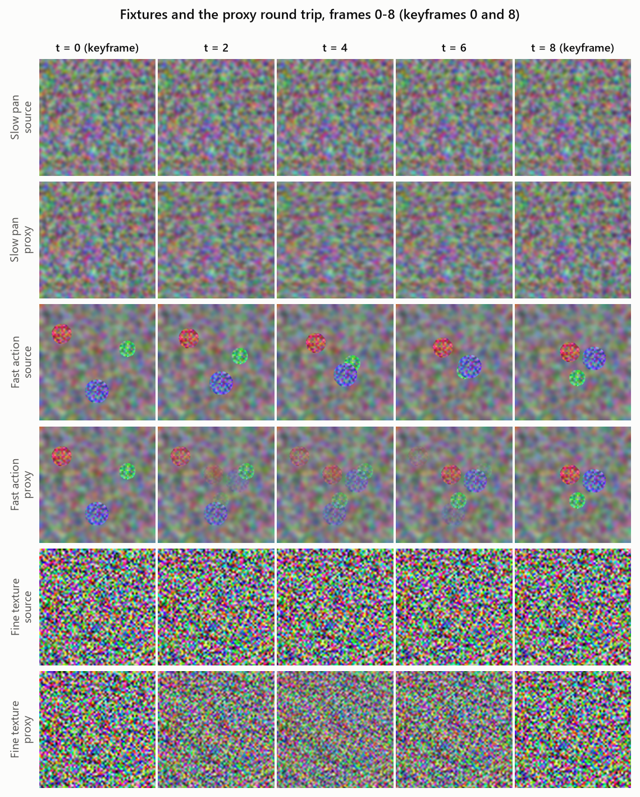
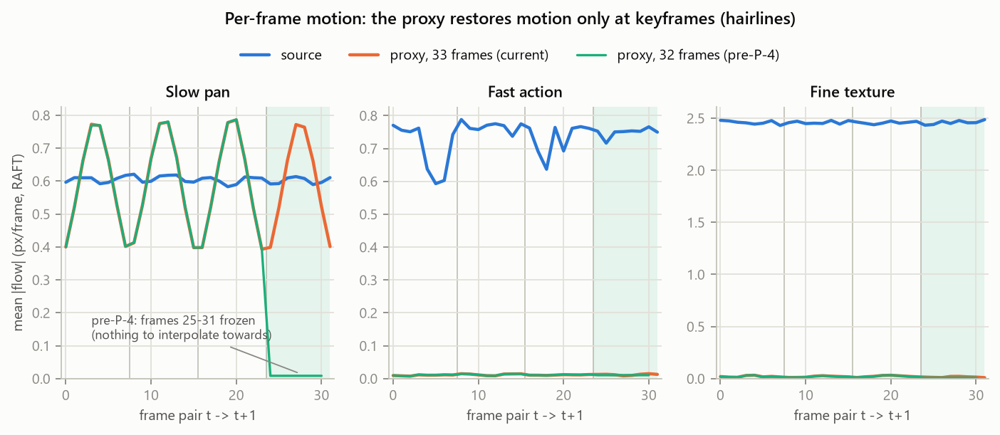
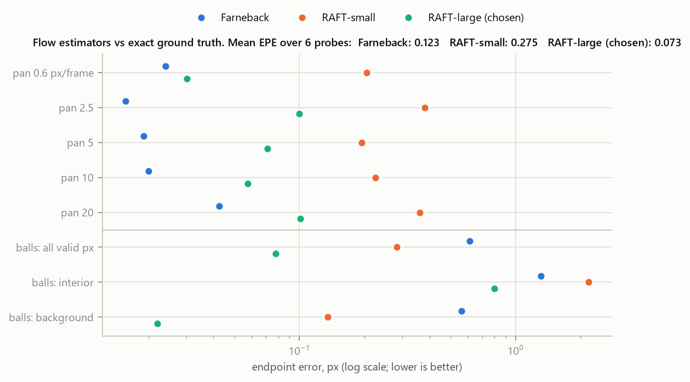
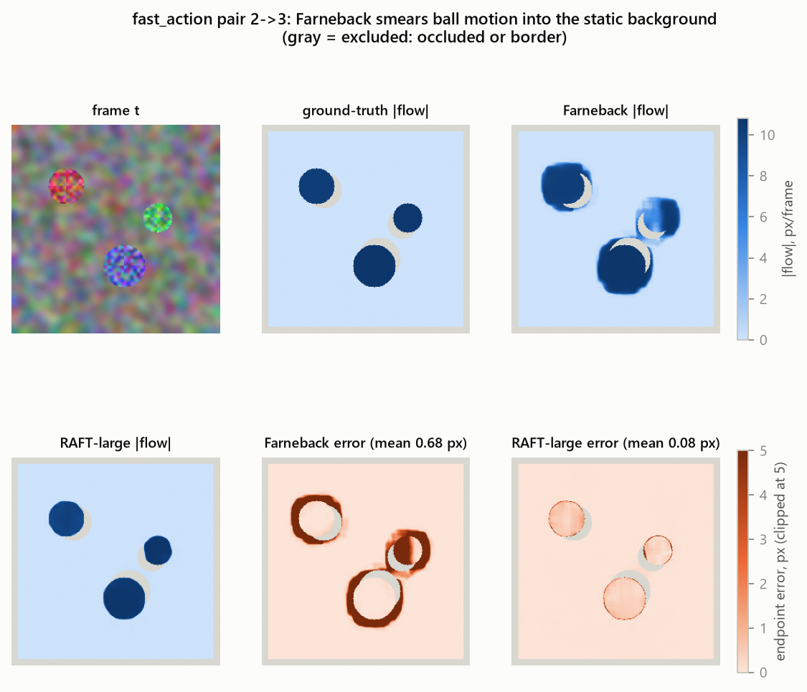
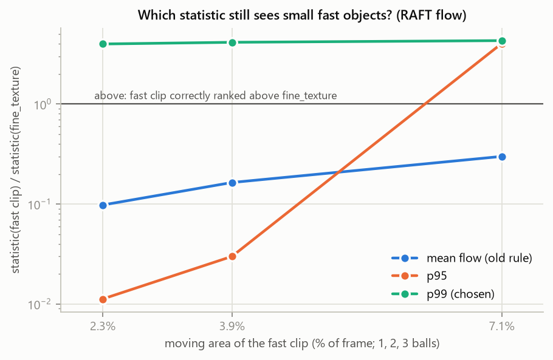

# codecfloor — Technical Reference

> **Scope.** This is the single technical reference for this repository: the quantities it measures, how the code is built, every change made so far with its evidence, the results, how each result is verified, and the open risks. It is dense by design; skim the headings, then read the section you need.
>
> **Status (2026-09-25).**
> - Prerequisite steps P-1 to P-4 are complete; 44 tests pass.
> - The measurement harness is validated on a proxy codec. No LTX-Video number exists yet.
> - The next step is G-1 (§12).
>
> **Label rule.** Every number in this document comes from the **proxy codec on synthetic clips, NOT the LTX-Video VAE**, unless stated otherwise.
>
> **Provenance rule.** Every result number cites the record it comes from: `runs/*.json` for measurements, `docs/figures/figure_data.json` for diagnostics. Nothing is typed in by hand except the paper's original draft values, which are marked as such.

| Companion | Role |
|---|---|
| [`HANDOVER_Implementation_Protocol.md`](../HANDOVER_Implementation_Protocol.md) | Working protocol (step format, rules R-1…R-8), roadmap, standing decisions D-1…D-6, risk register Q-1…Q-12 |
| [`DECISIONS.md`](../DECISIONS.md) | One row per decision: the choice, rejected alternatives, revisit condition |
| [`runs/`](../runs/) | Immutable measurement records (create-only, D-5) |
| [`scripts/make_figures.py`](../scripts/make_figures.py) | Regenerates every figure below |

---

## Contents

1. [Problem and quantities](#1-problem-and-quantities)
2. [Architecture](#2-architecture)
3. [Module reference](#3-module-reference)
4. [Environment and determinism controls](#4-environment-and-determinism-controls)
5. [Records, provenance, figures](#5-records-provenance-figures)
6. [Implementation log: challenges and solutions](#6-implementation-log-challenges-and-solutions)
7. [Results](#7-results)
8. [Verification matrix](#8-verification-matrix)
9. [Known limitations and open risks](#9-known-limitations-and-open-risks)
10. [Paper status](#10-paper-status)
11. [Reproduce everything](#11-reproduce-everything)
12. [Next: G-1](#12-next-g-1)
13. [Glossary](#13-glossary)

---

## 1. Problem and quantities

A latent video generator is `pixels → E (encoder) → z → denoiser → z' → D (decoder) → pixels`. Temporal defects are measured on output pixels and attributed to the denoiser, but the signal crosses the lossy codec (E, D) twice. At 1:192 compression, LTX-Video (32×32 spatial × 8 temporal, 128 channels) discards most temporal information before the denoiser sees it.

The **codec floor** is the temporal error of the reconstruction `R(x) = D(E(x))`, measured with no generation. It is a *lower bound* on codec-attributable error: round trips observe mechanisms M1–M5 and M8, not the design causes M6/M7 or the denoiser-side M9 (paper §IV). The project measures the floor and the end-to-end error with the **same reference-free instruments**, stratified by motion. Reference-free is required because generated video has no ground-truth clip.

### Definitions

| Symbol | Definition | Code |
|---|---|---|
| `x` | Clip, `(T, H, W, 3)` uint8 RGB, with `T = 8k+1` | [`video_io.py`](../codecfloor/video_io.py) |
| `F_t` | Dense flow from frame `t` to `t+1`, RAFT-large, `(H, W, 2)` px | [`flow.video_flow`](../codecfloor/flow.py) |
| `ME(x)` | **Motion energy** = mean over `t` and pixels `p` of `‖F_t(p)‖` (paper §V) | `metrics.mean_flow_magnitude` |
| `MR(x)` | **Motion retained** = `ME(R(x)) / ME(x)` | `scripts/proxy_validation.py` |
| `g_t` | Grayscale of frame `t`, in [0, 1] | `video_io.to_gray` |
| `WE(x)` | **Warping error**: for each pair, warp `g_{t+1}` back onto frame `t` with `F_t` (bilinear `cv2.remap`); take the mean `\|warped − g_t\|` over pixels at least `BORDER = 8` px from the edge; average over pairs | `metrics.warping_error_per_pair` |
| `ΔWE` | abs: `WE(R(x)) − WE(x)`; rel: `ΔWE_abs / WE(x)` | `proxy_validation.py` |
| `p_q` | `q`-th percentile of `‖F_t(p)‖` pooled over all `t` and `p` | `motion.flow_stats` |
| `EPE` | Endpoint error `‖F̂ − F_gt‖` (px), averaged over valid pixels | `scripts/flow_benchmark.py` |

**Why warping error is secondary (D-2).** `WE` rewards self-consistency. A reconstruction that *removes* motion (cross-fading between keyframes) has a small flow field and a well-predicted next frame, so `WE` falls while motion is destroyed. That is finding F-2 (§7.1). FVMD (keypoint velocity and acceleration statistics) is the primary metric, and is not yet integrated (roadmap F-2).

---

## 2. Architecture

```
                       ┌─────────────────────── codecfloor (domain layer) ───────────────────────┐
 video file ─► video_io.read_video / normalise ─► x : (T,H,W,3) uint8, T = 8k+1
                                     │
                                     ▼
                     Codec  (codec.py, ABC)                          implementations (peers, D-3)
                     ├─ encode(x) -> latent                          ├─ ProxyCodec   (proxy_codec.py)  M1+M4 only
                     ├─ decode(latent) -> x̂                          └─ LTXCodec     (F-1, not yet written)
                     ├─ config() -> dict  ──────────────► run manifest
                     └─ round_trip(x) = decode(encode(x))  + pixel-contract check
                                     │
                x, x̂ ───────────────┼──────────────► flow.video_flow  (RAFT-large, TF32 off, CHUNK=8)
                                     │                        │  F : (T-1,H,W,2)
                                     ▼                        ▼
                     metrics.temporal_metrics       motion.profile ─► strata_cutpoints / assign_strata
                     (WE, ME, raw diff; PSNR)       (p99 flow, HF energy, equal thirds)
                                     │
                                     ▼
                 scripts/*.py ─► runs/<kind>_<UTC>.json  (create-only)  ─► scripts/make_figures.py ─► docs/figures/*.png
```

**Invariants:**

| Invariant | Enforced by |
|---|---|
| Pixel contract `(T,H,W,3)` uint8 in and out of every codec | `Codec.round_trip` raises otherwise |
| `T = 8k+1` | `ProxyCodec.encode` raises (same contract as LTX) |
| Core imports without torch (D-6) | `tests/test_portable.py` import-hook guard |
| Flow settings in exactly one place | `flow.py`; `metrics` and `motion` import from it |
| Records never overwritten (D-5) | `open(path, "x")` |

---

## 3. Module reference

### `codecfloor/codec.py`

| Member | Contract |
|---|---|
| `Codec.name: str` | Short identifier, written to the manifest |
| `encode(video) -> Any` | Latent type is implementation-defined; the base never inspects it |
| `decode(latent) -> ndarray` | Must return `(T,H,W,3)` uint8. Kept separate from encode because the generation arm (D-1) decodes latents that were never encoded, and paper requirement R1 needs decode isolable |
| `config() -> dict` | Every setting that affects output |
| `round_trip(video)` | Validates the input shape and dtype; after decoding, raises `ValueError("round trip changed…")` on any change of shape or dtype |

### `codecfloor/proxy_codec.py`

| Member | Behaviour |
|---|---|
| `ProxyCodec(factor=8, mode="linear")` | Rejects any `mode` other than `"linear"` / `"nearest"` (previously an unknown mode silently ran linear) |
| `encode` | Requires `T = factor·k+1` (`k ≥ 1`); returns `video[::factor]` (strided, not pooled) |
| `decode` | `T = factor·(k−1)+1`. Linear: `(1−w)·kf[lo] + w·kf[hi]`, `w = i/factor − lo`. Nearest: `kf[floor(i/factor + ½)]`. Then `np.rint`, clip, uint8 |
| `temporal_decimate_restore(v, factor, mode)` | Wrapper, `ProxyCodec(...).round_trip(v)` |
| `spatial_blur_restore(v, factor=32)` | Spatial analogue, for contrast only |

### `codecfloor/flow.py`

| Member | Value / behaviour | Justification |
|---|---|---|
| `ESTIMATOR` | `"raft_large"` (torchvision `Raft_Large_Weights.C_T_SKHT_V2`) | Benchmark, §7.3 |
| `BORDER` | 8 | RAFT's 1/8-resolution feature grid; the outermost 8 px cell has no outward neighbours |
| `CHUNK` | 8 pairs per forward pass | Results chunk-invariant to <2e-4 px with TF32 off; fixed so VRAM never changes a number |
| `video_flow(v)` | `(T-1,H,W,2)` float32. Refuses `H` or `W` not divisible by 8 rather than padding. Disables `cudnn.allow_tf32` and `matmul.allow_tf32`, restoring them in `finally` | TF32 made flow depend on batch size (max 0.06 px) |
| `config()` | Estimator, weights, device, tf32, chunk, border, torch and torchvision versions | Manifest |
| `farneback(a, b)` | OpenCV tutorial settings (`0.5, 3, 15, 3, 5, 1.2`) | Benchmark baseline only |

### `codecfloor/metrics.py`

`TemporalMetrics(warp_error, warp_error_p95, raw_frame_diff, flow_mag)`. `temporal_metrics(v)` computes flow **once** and passes it to `warping_error_per_pair(v, flows)` and `mean_flow_magnitude(v, flows)`. `warp_error_p95` is the 95th percentile over pairs, descriptive only. `recon_psnr(a, b)` is paired and floor-path only; it never enters the decomposition.

### `codecfloor/motion.py`

`MotionProfile(dssim, flow_mag, flow_p95, flow_p99, hf_energy, stratum)`.

`strata_cutpoints(profiles)` requires N ≥ 3 and returns:
- `fast_action_flow_p99_cut = quantile(p99, 2/3)`;
- `fine_texture_hf_cut = median(hf_energy of clips below the fast cut)`;
- `statistic = "flow_p99"`.

`assign_strata(profiles, cutpoints=None)` labels the profiles in place and returns the cut-points used. Passing frozen cut-points (C-3) avoids recomputing on a new corpus.

### `codecfloor/synthetic.py`

All clips are 256×256 and 33 frames; they are instrument validation only (D-4).

| Clip | Construction | Ground truth |
|---|---|---|
| `slow_pan` | Gaussian-blurred texture; Lanczos-4 sub-pixel window at `x = 0.6·i` | Flow `(−0.6, 0)` px/frame |
| `fast_action(textured=True)` | Blurred background + 3 balls (r = 22, 18, 26) with rigidly attached texture (`skins[k]`, 50/50 blend with the ball colour); bounce physics in `ball_tracks()` | Ball pixel: centre displacement from `ball_tracks`; background: 0 |
| `fine_texture` | Unblurred texture, sub-pixel window at `(2.2i, 1.3i)`, plus per-frame Gaussian noise σ = 6 (seeded) | `(−2.2, −1.3)` px/frame, apart from the noise |

`ball_tracks(t)` is the single physics source, used by both the renderer and the benchmark ground truth. `_window` at an integer offset equals plain slicing, which is tested.

### `scripts/`

| Script | Output | Notes |
|---|---|---|
| `proxy_validation.py` | `runs/proxy_validation_<UTC>.json` | Paper Table III. Refuses OpenCV ≠ 4.x. Records codec config, flow config and library versions |
| `flow_benchmark.py` | `runs/flow_benchmark_<UTC>.json` | Decision rule in the docstring, fixed before any result. 5 pans + balls probe, T = 9, every run repeated twice |
| `make_figures.py` | `docs/figures/*.png`, `figure_data.json` | Result figures from records; diagnostic figures recomputed |

---

## 4. Environment and determinism controls

| Component | Version | Why pinned or noted |
|---|---|---|
| CPython | 3.14.3 (pyenv), `.venv` | CUDA torch wheels for cp314 on Windows verified on the pytorch index |
| numpy | 2.5.3 | Golden hashes were taken under it |
| opencv-python-headless | **4.14.0** (`>=4.9,<5`) | `cv2.remap` in 5.0 moves warping error by up to 6.2%; flow, SSIM and PSNR are unaffected |
| scikit-image / scipy | 0.26.0 / 1.18.1 | SSIM for DSSIM |
| torch / torchvision | 2.14.0+cu130 / 0.29.0+cu130 | RAFT; CUDA 13.0, driver 591.59, RTX 3060 12 GB |

Dependency tiers ([`pyproject.toml`](../pyproject.toml)):
- `core`: numpy, opencv-headless, scikit-image, scipy;
- `viz`: matplotlib, pandas;
- `gpu`: torch, torchvision, diffusers, peft, finetrainers;
- `dev`: pytest, ruff.

**D-6 was narrowed (P-3 B5b):** the package must *import* without torch, but flow-based metrics need torch and torchvision. The CPU build suffices, since CPU and GPU flow agree to 3e-4 px.

**Determinism ledger (measured, not assumed):**

| Source of variation | Measured effect | Control |
|---|---|---|
| OpenCV 4.14 vs 5.0 | `WE` ±6.2% (slow pan) | Pin `<5`; version in every record |
| TF32 convolutions on Ampere | Flow depends on batch size, up to 0.06 px | TF32 off inside `video_flow` |
| Chunk size (TF32 off) | 0 at chunks 8/16/32; ≤1.7e-4 px at chunk 1 | `CHUNK = 8` |
| CPU vs GPU RAFT (TF32 off) | ≤3.1e-4 px max, 5e-6 mean | Device recorded in `flow.config()` |
| Repeat run, identical input | 0 on GPU; 0.6% of EPE on CPU | Benchmark disqualification bar: 1% |
| Proxy float32 blend on another machine | Not yet measured on the laptop | Golden hashes fail loudly if it differs |

---

## 5. Records, provenance, figures

| Record | Content | Status |
|---|---|---|
| `runs/proxy_validation_20260925T083829Z.json` | Table III after P-4 (Farneback, flat balls, truncation) | Superseded |
| `runs/proxy_validation_20260925T085750Z.json` | P-2 regression re-run; every value identical to the record above | Superseded |
| `runs/proxy_validation_20260925T091403Z.json` | **Current Table III** (RAFT-large, textured balls, rounding) | **Current** |
| `runs/flow_benchmark_20260925T091042Z.json` | Estimator selection | Current |
| `docs/figures/figure_data.json` | Numbers behind the diagnostic figures | Regenerated with figures |

Figures are views, never the source of truth (HANDOVER §5.6). Figs 3 and 4 read only records. Figs 1, 2, 5 and 6 are deterministic diagnostics recomputed from the fixtures; their numbers are written to `figure_data.json`. Palette: reference categorical slots 1–3 (validated all-pairs; aqua below 3:1 contrast, so every chart has a legend and a table here); sequential blue for |flow|, sequential orange for error.

---

## 6. Implementation log: challenges and solutions

The four steps were run in the order P-1 → P-4 → P-2 → P-3; P-4 went early because it corrected a value already printed in the paper. Full rationale is in `DECISIONS.md`.

### P-1: package, tiers, portability guard

| # | Challenge | Evidence | Solution |
|---|---|---|---|
| 1 | Handover described a tested package; the folder had 5 loose modules, and `import codecfloor` failed | Directory listing | Created `codecfloor/`; SHA-256 of all 6 files identical after the move |
| 2 | A `"torch" in sys.modules` check passes trivially where torch is absent and misses `try/except` imports | Design analysis | Meta-path hook in a fresh `python -I` subprocess records every *attempt*. Modules discovered from the filesystem, because `pkgutil` skips broken ones. Self-tests plant violations; a planted `try: import torch` in the real package failed the test and named the file |
| 3 | pip resolved OpenCV **5.0.0** | 45-value fingerprint diff, 4.14 vs 5.0: only `WE` moved (max rel 6.2e-2) | Pin `<5`. The draft's Table III then reproduced **exactly** |

### P-4: frozen tail and stepped pans

| # | Challenge | Evidence | Solution |
|---|---|---|---|
| 4 | With `T = 32`, keyframes are {0, 8, 16, 24}; frames 25–31 had `hi = lo` and were held static (7/32 frames) | Fig 2, aqua curve: slow-pan motion drops to 0.0085 px/frame over pairs 24–30 | Require `T = 8k+1` (LTX README: "divisible by 8 + 1"; diffusers `latent = (T−1)//8+1`); fixtures lengthened to 33, with frames 0–31 unchanged (tested) |
| 5 | The new "no identical consecutive frames" test failed on the *fixed* code: `slow_pan` used `int(0.6·i)`, so it stuttered (13/32 pairs identical) and `fine_texture` alternated 2/3 px steps | Per-pair flow CV 0.826 / 0.181 | Sub-pixel Lanczos-4 window: CV 0.015 / 0.002; bound 0.05 in a test. The draft's slow-pan "+1367%" was this stutter |

### P-2: `Codec` interface

| # | Challenge | Solution |
|---|---|---|
| 6 | Prove a refactor moves no byte | Golden SHA-256 of all 6 (clip × mode) outputs taken before the change; the run record re-generated identically; a 0.1% weight change fails 3 tests |
| 7 | Unknown `mode` silently ran linear | Rejected at construction |
| 8 | A codec could silently change frame count or size, and metrics would still compute on misaligned frames | `round_trip` checks the contract; planted codecs that drop a frame, crop, or return floats are rejected |

### P-3: constant audit, stratifier, flow estimator

| # | Challenge | Evidence | Solution |
|---|---|---|---|
| 9 | Farneback recovered **35%** of the true ≈10.4 px/frame ball displacement (80% on textured balls). Flat discs have no interior texture (the aperture problem) | Ball-core and edge-ring flow vs replayed physics | Balls carry rigid texture; trajectories proven unchanged (a 3 px shift fails the test) |
| 10 | Which estimator? | Rule fixed before running: min mean EPE over 6 exact-GT probes, ties within 10% go to the faster one, repeat drift > 1% disqualifies | **RAFT-large**, 0.073 px vs Farneback 0.123 (§7.3) |
| 11 | TF32 made RAFT batch-dependent (≤0.06 px) | Chunk sweep 1/4/8/16 vs 32 | TF32 off inside the call, restored after; `CHUNK = 8` |
| 12 | Mean-flow stratifier labelled fast_action → slow_pan and fine_texture → fast_action | Fixture profiles | p99 plus equal thirds (Fig 6: correct at every moving area tested) |
| 13 | `astype(uint8)` truncates, a −0.3-level bias | Slow-pan Δwarp moved 4 points | `np.rint` |
| 14 | `round()` is half-to-even: frame 4 → keyframe 0, but frame 12 → keyframe 16 | Code reading | `floor(pos + ½)`; test on frames 4/12/20/28 |
| 15 | Farneback settings duplicated in two modules; `border = 8` unjustified; 0.70 texture quantile unjustified (R-4) | Audit | One `flow.py`; `BORDER` derived from RAFT's stride; equal thirds |
| 16 | **Own bug:** in the first textured-ball version, the bounce loop `for k in (0, 1)` reused the ball index, so every ball got `skins[1]` | Before/after hash of the `ball_tracks` refactor differed | Explained, fixed, flat version verified byte-identical to the original fixture; never used in a record |
| 17 | Metrics docstring called warping error "primary", contradicting D-2 | Audit | Corrected |

---

## 7. Results

### 7.1 Table III: proxy round trip

Record `runs/proxy_validation_20260925T091403Z.json`; RAFT-large; OpenCV 4.14.0.

| Clip | `ME(x)` src | `ME(R(x))` rec | **MR** | `WE(x)` | `WE(R(x))` | **ΔWE abs** | **ΔWE rel** |
|---|---|---|---|---|---|---|---|
| Slow pan | 0.604 | 0.590 | **97.7%** | 0.00142 | 0.00280 | **+0.0014** | **+98.1%** |
| Fast action | 0.737 | 0.011 | **1.6%** | 0.00327 | 0.00172 | **−0.0015** | **−47.2%** |
| Fine texture | 2.459 | 0.019 | **0.8%** | 0.01698 | 0.02341 | **+0.0064** | **+37.9%** |

`ME` is in px/frame; `WE` is a mean absolute residual on [0, 1] grayscale.

- **Validity of the source measurements.** Slow pan measures 0.604 against a true 0.600. For fast action, 0.737 is consistent with 7.1% of the frame moving at about 10.6 px/frame (expected ≈0.75).
- **F-1 (stratified loss):** 97.7% vs 1.6% vs 0.8%.
- **F-2 (warping error unsafe):** on fast action, `WE` falls 47.2% while 98.4% of the motion energy is removed. The effect is specific to fast action: on fine texture `WE` rises, correctly.



| Version | Slow pan (MR / ΔWE rel) | Fast action | Fine texture | What changed |
|---|---|---|---|---|
| Draft (as printed) | 71.5% / +1367% | 3.9% / −40.4% | 3.9% / +0.2% | — |
| P-4 | 91.8% / +93.7% | 5.2% / −22.0% | 5.1% / +42.8% | 8k+1 frames; sub-pixel pans |
| **P-3** | **97.7% / +98.1%** | **1.6% / −47.2%** | **0.8% / +37.9%** | Textured balls, RAFT-large, rounding |

### 7.2 What the proxy does, frame by frame



Between keyframes 0 and 8 the proxy cross-fades rather than displaces. In fast action this produces ghosted double balls (t = 2–6); in fine texture it produces blended, moiré-like texture. This is mechanisms M1 (decimation) and M4 (interpolation upsampling) in isolation.



`figure_data.json` → `fig2`:

| Clip | Source mean / CV | Proxy mean / CV | Proxy per-pair range |
|---|---|---|---|
| Slow pan | 0.604 / 0.016 | 0.590 / **0.240** | 0.393–0.786 |
| Fast action | 0.737 / 0.068 | 0.011 / 0.176 | 0.007–0.015 |
| Fine texture | 2.459 / 0.006 | 0.019 / 0.347 | 0.009–0.032 |

**New observation (Q-12).** For the slow pan, motion energy is *conserved in total but redistributed in time*: a sawtooth that peaks mid-interval, with CV rising 15×. "97.7% retained" is true of the mean and misleading about the motion. The aqua curve shows the pre-P-4 frozen tail: the proxy's old decode applied to the current fixtures' first 32 frames drops to 0.0085 px/frame over pairs 24–30.

### 7.3 Flow-estimator selection

Record `runs/flow_benchmark_20260925T091042Z.json`. Probes: textured pans at a 30° heading (5 speeds) and the ball probe (T = 9, 8 pairs). Excluded pixels: those within `BORDER` of the edge, background a ball covers in the next frame, and ball pixels overlapping another ball.



| EPE (px) | pan 0.6 | pan 2.5 | pan 5 | pan 10 | pan 20 | balls | balls interior / background | **mean** | ms/pair |
|---|---|---|---|---|---|---|---|---|---|
| Farneback | 0.024 | 0.016 | 0.019 | 0.020 | 0.043 | 0.615 | 1.311 / 0.561 | 0.123 | 9.3 |
| RAFT-small | 0.204 | 0.380 | 0.194 | 0.225 | 0.361 | 0.282 | 2.181 / 0.135 | 0.275 | 13.0 |
| **RAFT-large** | 0.030 | 0.100 | 0.071 | 0.058 | 0.101 | **0.078** | **0.797 / 0.022** | **0.073** | 24.0 (33 with TF32 off; CPU 450) |

**Reading the benchmark:**
- Farneback is the most accurate on **global** translation at every speed.
- It loses on **local** motion: it spreads object motion into the surrounding static background (background EPE 0.56 vs 0.02), visible as the halos in Fig 5.
- The paper's subject is local and fast motion, and the pre-registered rule selects RAFT-large (−40% mean EPE, outside the 10% tie band).
- RAFT-large recovers 96.5% of the ball speed.



Pair 2→3 (`figure_data.json` → `fig5`): mean EPE Farneback 0.676 px, RAFT-large 0.076 px. RAFT's residual error is confined to one-pixel rims at the disc boundaries.

### 7.4 Stratification statistic



The fast_action fixture was rendered with its first 1, 2 and 3 balls. The local renderer is asserted byte-identical to `fast_action()` at 3 balls. The figure plots `stat(fast) / stat(fine_texture)`; a ratio above 1 means correctly ranked as faster.

| Moving area | mean ratio | p95 ratio | **p99 ratio** |
|---|---|---|---|
| 2.3% (1 ball) | 0.098 | 0.011 | **3.996** |
| 3.9% (2 balls) | 0.164 | 0.030 | **4.154** |
| 7.1% (3 balls) | 0.300 | 4.042 | **4.318** |

**Why p99:**
- Mean flow **never** ranks the fast clip above fine texture, which is Q-6 reproduced.
- p95 only succeeds once more than 5% of the frame moves. This follows from the definition: `p_q` only sees motion covering more than `(100−q)%` of the pixels.
- p99 is correct at every area tested and stays near-constant, reading the balls' true ≈10–11 px/frame.

---

## 8. Verification matrix

44 tests (`pytest -q`, about 14 s on an RTX 3060). A **mutation** entry means the named break was actually applied and the tests failed.

| Test file | Tests | Protects | Mutation evidence |
|---|---|---|---|
| `test_portable.py` | 5 | Core import without gpu/viz tiers; guard self-tests; lazy imports allowed | Planted `try: import torch` in `codecfloor/` → fails, names the file |
| `test_proxy_codec.py` | 18 | 8k+1 rejection; no held frames; keyframes exact; fixtures T-independent; `_window` equals a crop at integer offsets; uniform pan speed (CV < 0.05); textured trajectories within 1 px of flat; nearest-mode ties | Dropping the last keyframe → 6 fail; old stepping → CV 0.826 fails; +3 px ball shift → fails |
| `test_codec.py` | 13 | Golden hashes (6); T recovered from keyframes; bad mode; incomplete ABC; contract violations (3); bad input | Blend weight ×0.999 → 3 fail |
| `test_motion.py` | 4 | Fixtures land in their own strata; frozen cut-points honoured; equal thirds; N < 3 raises | The old mean-flow rule fails the first test (Fig 6) |
| `test_flow.py` | 4 | RAFT pan EPE < 0.25 px; chunk invariance < 1e-3 px; TF32 flags restored; refuses sizes not divisible by 8 | TF32 left on → chunk test fails; normalisation removed → accuracy test fails |

Golden hashes were re-taken once, after P-3's *intended* output changes (rounding, tie-breaking, textured balls), and the provenance is noted in the test file.

---

## 9. Known limitations and open risks

| ID | Issue | Consequence | Resolution path |
|---|---|---|---|
| Q-1 | LTX decode determinism unknown | Floor may be a distribution | G-3 |
| Q-2 | Untiled LTX in 12 GB unknown; tiling is itself M3 (D-1) | Would weaken the claim | G-4: reduce resolution or frames before tiling |
| Q-8 | "Codec share" undefined. FVMD (a Fréchet distance) is not additive across codec and denoiser; a stratum can show floor > end-to-end | The headline percentages are arithmetic on a non-additive quantity | Decide before F-2; test additivity on the proxy |
| Q-9 | A generated video has no source clip; stratifying by its own motion biases the result | Per-stratum end-to-end numbers skew toward the hypothesis | Condition generation on stratum source clips (image + caption) |
| Q-12 | Motion energy is timing-blind (§7.2) | "Motion retained" overstates preservation | Report per-pair dispersion; lean on FVMD (velocity + acceleration) |
| C-3 | p99 stability on real clips untested | Unstable strata | Bootstrap on the corpus |
| — | RAFT accuracy measured on synthetic motion only | [ASSUMED] to transfer to real video | Spot-check at F-2 |
| — | CPU RAFT is 450 ms/pair | Laptop demo (Mode B) is slow: about 45 s per clip | Accepted (user ranked accuracy above portability) |
| — | Paper ref [8] (LangPrecip) is a radar paper; the M8 support is confounded with channel count | Weak citation | Author's call (comment in the docx) |

---

## 10. Paper status

`Review_Paper_IEEE.docx`: every change is a tracked change authored as "Claude", plus 4 comments.

| Item | State |
|---|---|
| Table III (9 cells) and the §V sentence | Current P-3 values (47.2% / 98.4%) |
| References [3], [5]–[8], [10], [11] | Authors and titles from the arXiv API; [7] retitled; "CREPA:" removed from [10] |
| Author block | Kadam, Shitole, Wavre, Singh, Zambare, with `firstname.lastname@pccoepune.org` |
| Comments | Table III provenance; §V slow-pan sentence obsolete; RAFT citation now correct; [8] weak |
| **Pending: 18 LTX values** | §V LTX ΔWE vs ΔME: G-1…G-4, C-1…C-3, F-1 (no FVMD or generation needed; the cheapest). Table II floor and §III.A "×": + F-2…F-4. Codec share, abstract, conclusion (8): + D-1 and decisions on Q-8/Q-9 |

---

## 11. Reproduce everything

```powershell
python -m venv .venv
.venv\Scripts\pip install torch==2.14.0 torchvision==0.29.0 --index-url https://download.pytorch.org/whl/cu130
.venv\Scripts\pip install -e ".[viz,dev]"

.venv\Scripts\python.exe -m pytest -q                  # 44 passed
.venv\Scripts\python.exe scripts\proxy_validation.py   # new runs/proxy_validation_*.json; values = §7.1
.venv\Scripts\python.exe scripts\flow_benchmark.py     # new runs/flow_benchmark_*.json; RAFT-large 0.073
.venv\Scripts\python.exe scripts\make_figures.py       # docs/figures/*
```

Expected: every value in §7 reproduces to the printed precision on the same library versions. On another machine, the golden-hash tests are the first thing that would flag a numeric difference.

---

## 12. Next: G-1

Inspection only; no production code. The step determines:
- the exact decode signature of the installed diffusers LTX VAE (`AutoencoderKLLTXVideo`);
- every conditioning parameter and its default;
- whether a deterministic, reconstruction-only setting exists.

This matters because LTX assigns the decoder the final denoising step, so "decode" may be partly generative.

**Lead found so far:** `pipeline_ltx.py` defaults to `decode_timestep = 0.0` and `decode_noise_scale = None`. G-1 must establish what the VAE does with these values, not what the pipeline passes. It unblocks G-2 (single-frame round trip), G-3 (determinism, Q-1) and G-4 (VRAM and tiling, Q-2).

---

## 13. Glossary

| Term | Meaning |
|---|---|
| Codec floor | Temporal error of `D(E(x))`: a lower bound on codec-attributable error |
| Proxy codec | M1 + M4 in isolation, with no learned part; never presented as LTX |
| M1…M9 | Paper Table I mechanisms (M1 decimation, M3 tiling, M4 interpolation upsampling, …) |
| Motion energy / retained | `ME` = mean flow magnitude; `MR = ME(R(x)) / ME(x)` |
| Warping error | Flow-compensated residual; rewards smoothness; secondary (D-2) |
| FVMD | Fréchet Video Motion Distance; primary (D-2); not yet integrated |
| EPE | Flow endpoint error, px |
| 8k+1 | LTX frame contract (9, 17, 25, 33, …) |
| Equal thirds | Strata: top third by p99 flow = fast_action; the rest split at median texture energy |
| Golden hash | SHA-256 of an output at a verified point; any unintended change fails |
| Mutation test | Deliberately breaking code to prove a test catches it |
| TF32 | Ampere reduced-precision matmul/conv mode; disabled for flow |
